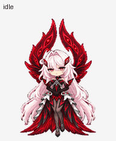

# ronova-chibi-pet
A chibi pet for gpt, it is based on Ronova from genshin impact. 

## Artwork and previews

| File | Description |
| --- | --- |
| [Animated sprite sheet](assets/spritesheet.png) | Transparent PNG used by the custom pet |
| [Chibi character art](assets/ronova-chibi-pixel.png) | Approved single-pose pixel-art reference |
| [All animations](assets/all-states.gif) | Animated preview of the nine standard states |
| [MP4 preview](assets/all-states.mp4) | Video copy of the animation preview |
| [Idle-to-jump loop](assets/idle-jump-idle.gif) | Jump timing and landing preview |
| [Look-direction loop](assets/look-loop.gif) | Sixteen clockwise gaze directions |
| [Contact sheet](assets/contact-sheet.png) | Labeled animation frames |
| [Direction sheet](assets/directions.png) | Labeled gaze frames |

The sprite sheet is **1536 × 2288 pixels**, with 192 × 208 pixel cells in an eight-column, eleven-row grid. It has nine animation states and sixteen look directions. All unused cells are transparent. The final sheet passed the Pets sprite-sheet validator with all 73 required frames present.

## Credit

Ronova and *Genshin Impact* belong to HoYoverse. This is a fan-made project, not an official HoYoverse release or endorsement. The artwork was created from references supplied by the repository owner.

No license is granted for third-party use of the artwork or underlying character.
